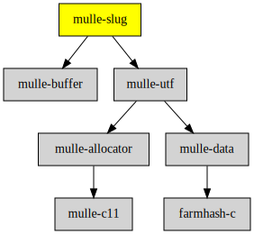

# mulle-slug

#### 🐌 Creates URL slugs

Create a [slug](https://de.ryte.com/wiki/Slug) from some arbitrary text,
suitable for inclusion in a URL as a path or fragment.

#### What is a Slug?

A slug is a URL-safe representation of a page title, often used in web
development to create clean and readable URLs.
Slugs are typically all lowercase and replace spaces with hyphens, making them
more human-friendly than raw URL-encoded strings.
For example, the page title "A Beginner's Guide to Web Development" could have
the slug "a-beginners-guide-to-web-development". The term "slug" is derived
from the publishing industry, where it refers to a short, descriptive label for
an article or story. **mulle-slug** preserves case though.


| Release Version                                       | Release Notes
|-------------------------------------------------------|--------------
|  [](//github.com/mulle-c/mulle-slug/actions)  | [RELEASENOTES](RELEASENOTES.md) |


## API

### `mulle_slugify`

```c
char *mulle_slugify(char *dst, size_t dst_len, char const *src, size_t src_len);
```

This function creates a URL slug from the given source string `src` and stores
it in the destination buffer `dst`. The `dst_len` parameter specifies the size
of the destination buffer, and `src_len` specifies the length of the source string.

### `mulle_slugify_with_delimiter`

```c
char *mulle_slugify_with_delimiter(char *dst, size_t dst_len, char const *src, size_t src_len, char delimiter);
```

This function is similar to `mulle_slugify`, but it allows you to specify a
custom delimiter character instead of the default hyphen `-`.

### Example Code

Here's an example of how to use the mulle-slug library:

```c
#include <stdio.h>
#include <string.h>
#include <mulle-slug/mulle-slug.h>

int main() {
    const char *input = "## Take me home!";
    size_t input_len = strlen(input);
    char output[256];

    mulle_slugify(output, sizeof(output), input, input_len);

    printf("Input: %s\n", input);
    printf("Slugified: %s\n", output);

    return 0;
}
```

This example demonstrates how to use the `mulle_slugify` function to create a
URL slug from the given input string. The output will be:

```
Input: ## Take me home!
Slugified: Take-me-home
```


### You are here




## Add

**This project is a component of the [mulle-core](//github.com/mulle-core/mulle-core) library. As such you usually will *not* add or install it
individually, unless you specifically do not want to link against
`mulle-core`.**


### Add as an individual component

Use [mulle-sde](//github.com/mulle-sde) to add mulle-slug to your project:

``` sh
mulle-sde add github:mulle-c/mulle-slug
```

To only add the sources of mulle-slug with dependency
sources use [clib](https://github.com/clibs/clib):


``` sh
clib install --out src/mulle-c mulle-c/mulle-slug
```

Add `-isystem src/mulle-c` to your `CFLAGS` and compile all the sources that were downloaded with your project.


## Install

### Install with mulle-sde

Use [mulle-sde](//github.com/mulle-sde) to build and install mulle-slug and all dependencies:

``` sh
mulle-sde install --prefix /usr/local \
   https://github.com/mulle-c/mulle-slug/archive/latest.tar.gz
```

### Manual Installation

Install the requirements:

| Requirements                                 | Description
|----------------------------------------------|-----------------------
| [mulle-utf](https://github.com/mulle-c/mulle-utf)             | 🔤 UTF8-16-32 analysis and manipulation library
| [mulle-buffer](https://github.com/mulle-c/mulle-buffer)             | ↗️ A growable C char array and also a stream

Download the latest [tar](https://github.com/mulle-c/mulle-slug/archive/refs/tags/latest.tar.gz) or [zip](https://github.com/mulle-c/mulle-slug/archive/refs/tags/latest.zip) archive and unpack it.

Install **mulle-slug** into `/usr/local` with [cmake](https://cmake.org):

``` sh
cmake -B build \
      -DCMAKE_INSTALL_PREFIX=/usr/local \
      -DCMAKE_PREFIX_PATH=/usr/local \
      -DCMAKE_BUILD_TYPE=Release &&
cmake --build build --config Release &&
cmake --install build --config Release
```

## Acknowledgments

This is a C port of [C++ Slugify](https://github.com/thomasbrueggemann/cpp-slugify)
with a different, probably much faster, algorithm.

## Author

[Nat!](https://mulle-kybernetik.com/weblog) for Mulle kybernetiK  


